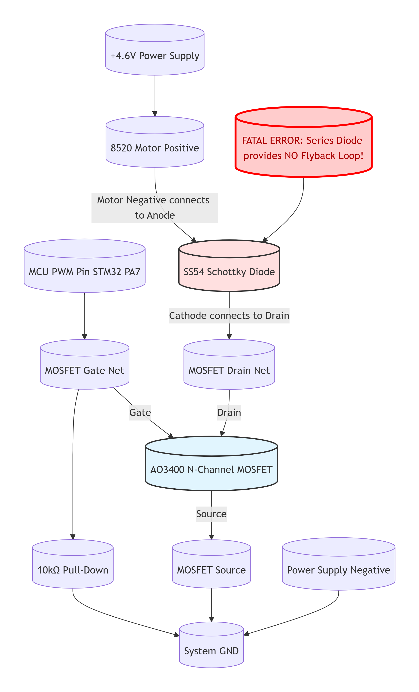
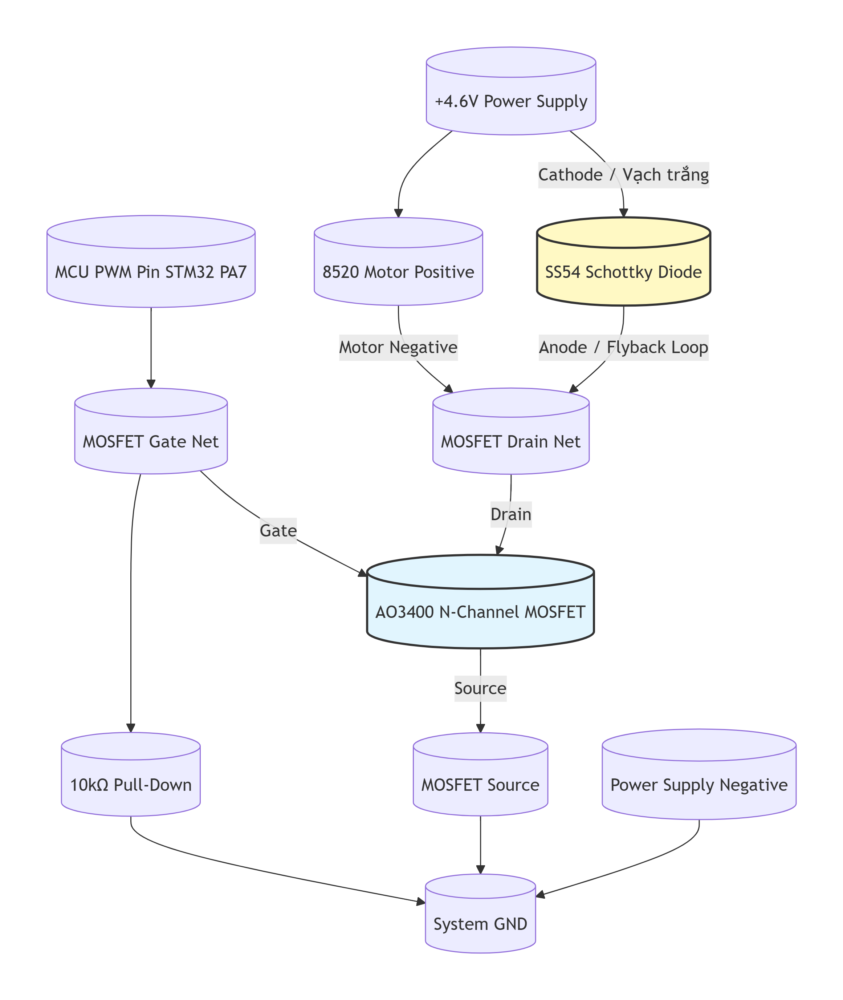

# Stage 10.5 Final Release: Motor Hardware - Theory, Practice & Failure Analysis
**Tài liệu Master: Thiết kế Tiêu chuẩn, Lý thuyết Động lực học, Nhật ký Debug và Phân tích Lỗi Động cơ 8520**

Tài liệu này ghi chép lại toàn bộ quá trình thiết kế, kiểm thử, phân tích lỗi và hoàn thiện mạch điều khiển động cơ DC Coreless 8520 bằng vi điều khiển (STM32/ESP32) sử dụng N-Channel Enhancement MOSFET.

---

## PHẦN 1: TỔNG QUAN LINH KIỆN & TÀI LIỆU (BOM & Datasheets)

**1. MOSFET: AO3400 (Mã in SMD: A09T) - Dòng N-Channel Enhancement**
* **Chức năng:** Làm "Van điện tử" đóng cắt dòng điện công suất lớn. Mặc định tắt (Normally OFF), mở khi có xung dương từ MCU.
* **Thông số tử huyệt:**
  * Điện áp Drain-Source Max ($BV_{DSS}$): `30V`. (Giới hạn điện áp nguồn cấp).
  * Điện áp Gate-Source Max ($V_{GS}$ Max): `±12V`. (Giới hạn điện áp điều khiển đâm thủng lớp cách điện).
  * Dòng điện liên tục Max ($I_D$): `5.8A`.
  * Nội trở khi mở ($R_{DS(ON)}$): `~25mΩ` @ 3.3V (Siêu nhỏ, giúp MOSFET không bị nóng).
  * Tụ ký sinh Miller ($C_{rss}$): `50 pF`. (Cầu nối truyền xung dội ngược từ Drain về Gate).
  * Điện dung buồng lái Gate ($C_{iss}$): `630 pF`.
  * Thời gian ngắt ($t_{D(off)} + t_f$): `~29ns` (Tính tròn `30ns` cho lý thuyết. Tốc độ ngắt cực nhanh đẻ ra xung dội cực mạnh).
* **Datasheet:** [AO3400 Official Datasheet - Alpha & Omega](https://www.aosmd.com/sites/default/files/res/datasheets/AO3400.pdf)

**2. Flyback Diode: SS54 (Schottky Rectifier)**
* **Chức năng:** Làm "Van xả áp suất", được mắc song song ngược chiều với tải cảm. Tạo vòng lặp khép kín xả dòng quán tính (Flyback current) để triệt tiêu suất điện động cảm ứng sinh ra khi ngắt MOSFET.
* **Thông số tử huyệt:**
  * Dòng điện chịu đựng liên tục ($I_{F(AV)}$): `5A` (Dư sức gánh dòng xả 2A của Motor 8520).
  * Điện áp ngược cực đại ($V_{RRM}$): `40V` (Chặn an toàn nguồn Tổ ong/Pin LiPo).
  * Dòng đỉnh quá tải ($I_{FSM}$): `150A` (Sức chịu đựng cú va đập búa nước điện từ).
  * Áp rớt thuận ($V_F$): Cực thấp `~0.55V`. Mở cửa ngay lập tức khi áp dội vừa chớm vượt qua điện áp nguồn cấp.
* **Datasheet:** [SS54 Vishay Datasheet](https://www.vishay.com/docs/88746/ss52.pdf)

**3. Điện trở Pull-down: 10kΩ (Dán SMD 0805)**
* **Chức năng:** Làm "Đường cống xả", xả tĩnh điện và các dòng điện rò rỉ từ chân Gate về mốc GND 0V. Ngăn hiện tượng Floating Gate biến MOSFET thành chiếc ăng-ten hút tĩnh điện tự mở mạch ngoài ý muốn.
* **Thông số:** Giá trị `10kΩ`, Công suất `1/8 W`.
* **Datasheet:** [Yageo RC0805 Thick Film](https://www.yageo.com/upload/media/product/productsearch/datasheet/rchip/PYu-R_RC_21_RoHS_L_13.pdf)

**4. Lý thuyết Nền tảng (N-Channel MOSFET)**
* **Tài liệu học thuật:** [EE 230 - NMOS Field Effect Transistors](https://gtuttle.net/electronics/topics/nmos.pdf).
* **Sự phá hủy (Gate Oxide Breakdown):** Lớp cách điện Silicon Dioxide ngăn cách giữa buồng lái Gate và Kênh dẫn (Drain-Source) rất mỏng. Nó sẽ bị đâm thủng rỗ mặt và chập vĩnh viễn nếu áp suất chênh lệch $V_{GS}$ vượt qua ngưỡng an toàn tuyệt đối **$\pm12V$**.

> 📝 **SỔ TAY KỸ SƯ (NOTE QUAN TRỌNG):**
> * **$V_{DS}$ (Nguồn cấp) khác với $V_{GS}$ (Áp điều khiển):** Việc cắm nguồn 4.6V hay 12V vào Tổ ong không tự tay giết MOSFET vì $BV_{DSS}$ của AO3400 là 30V. Kẻ giết Gate là **Xung dội ngược (Flyback Spike)** sinh ra từ cuộn dây động cơ. Nếu không có Diode SS54, nguồn 4.6V cũng phóng ra được xung 600V đâm thẳng vào bụng Drain, mượn đường qua tụ ký sinh $C_{rss}$ dội ngược một áp suất lớn hơn $\pm12V$ vào chân Gate và hủy diệt lớp cách điện.

---

## PHẦN 2: LÝ THUYẾT & CÔNG THỨC ĐỘNG LỰC HỌC (BÚA NƯỚC ĐIỆN TỪ)

Để hiểu tận cùng bản chất vật lý của hệ thống, chúng ta tính toán dựa trên các hằng số: 
* Độ tự cảm cuộn dây động cơ: $L = 10 \mu H$.
* Điện trở cuộn dây khi tải nặng: $R_m = 2.3 \Omega$.
* Tụ ký sinh Miller: $C_{rss} = 50 pF$.
* Tụ buồng lái Gate: $C_{iss} = 630 pF$.
* Thời gian sập cửa MOSFET: $dt = 30 ns$.

### 2.1. Trạng thái ON (Định luật Ohm & Nhiệt lượng MOSFET)
Khi MOSFET mở toang cửa, dòng điện chạy qua động cơ được tính bằng định luật Ohm:
$$I = \frac{V_{RMS}}{R_m}$$
*(Ví dụ ở 4.6V: $I = 4.6V / 2.3\Omega = 2A$)*

Điện áp rớt trên MOSFET (quyết định nó nóng hay mát):
$$V_{Drain} = I \times R_{DS(ON)} = 2A \times 0.025\Omega = \mathbf{0.05V}$$
*(MOSFET hoạt động cực kỳ mát mẻ khi dẫn điện).*

### 2.2. Trạng thái OFF (Sự hình thành Búa nước điện từ ở chân Drain)
Khi MOSFET ngắt cái "Rầm" trong $30ns$, dòng điện $I$ đang chảy qua cuộn dây bị chặn đứng. Cuộn dây lập tức sinh ra Suất điện động cảm ứng (áp dội):
$$V_L = L \cdot \frac{di}{dt}$$
* **NẾU KHÔNG CÓ DIODE BẢO VỆ:** Điện áp tại chân Drain vọt lên kinh hoàng: 
  $$V_{Drain\_Fail} = V_{CC} + V_L = V_{CC} + \left( 10\mu H \cdot \frac{I}{30ns} \right)$$
* **NẾU CÓ DIODE SS54 MẮC SONG SONG:** Diode mở cửa xả áp ngay lập tức, ghim chặt điện áp Drain ở mức an toàn:
  $$V_{Drain\_Safe} = V_{CC} + V_{F\_Diode} \approx V_{CC} + 0.5V$$

### 2.3. Kẻ nội gián truyền xung ($I_{gate\_spike}$)
Sự thay đổi điện áp đột ngột ($dV/dt$) tại chân Drain sẽ ép một dòng điện chạy xuyên qua tụ ký sinh tàng hình $C_{rss}$ đâm thẳng vào buồng lái Gate:
$$I_{gate} = C_{rss} \cdot \frac{dV_{Drain}}{dt}$$

### 2.4. Sự hủy diệt buồng lái ($\Delta V_{GS}$)
Dòng điện nội gián này nạp vào chân Gate (vốn là một cái tụ $C_{iss}$), tạo ra một áp suất phá vỡ lớp cách điện Silicon Dioxide (Giới hạn là $\pm12V$):
$$\Delta V_{GS} = (V_{Drain} - 0.05V) \cdot \frac{C_{rss}}{C_{iss} + C_{rss}}$$
*(Chỉ cần $\Delta V_{GS} > 12V$, MOSFET chết chập vĩnh viễn).*

---

## PHẦN 3: SƠ ĐỒ MẠCH ĐỘNG LỰC & PROMPT RENDER (Mermaid.js)

### 3.1. MẠCH LỖI: Mắc Diode nối tiếp (Fatal Error)
**Bản chất lỗi:** Diode mắc chen giữa Motor và MOSFET làm hở mạch khi Fet đóng. Xung điện từ 600V không có vòng lặp để xả, giáng thẳng vào chân Drain làm nổ Fet.



> **Prompt cho AI vẽ Mạch Lỗi:**
> ```text
> Act as a Senior Hardware Engineer. Generate a Mermaid.js flowchart (Graph TD) illustrating an INCORRECT/FAILED N-Channel MOSFET motor control circuit.
> CRITICAL STYLE REQUIREMENT: You MUST use the database/cylinder shape syntax `NodeID[(Label)]` for ALL nodes.
> Nodes and Routing (Showing the Fatal Error):
> 1. `MCU[(MCU PWM Pin STM32 PA7)]` connects to `GateNet[(MOSFET Gate Net)]`.
> 2. `GateNet` connects to `MOSFET[(AO3400 N-Channel MOSFET)]` with the label `|Gate|`.
> 3. `GateNet` also connects to `PullDown[(10kΩ Pull-Down)]`.
> 4. `VCC[(+4.6V Power Supply)]` connects to `MotorPos[(8520 Motor Positive)]`.
> 5. THE ERROR: `MotorPos` connects down to `Diode[(SS54 Schottky Diode)]` with the label `|Motor Negative connects to Anode|`. 
> 6. `Diode` connects down to `DrainNet[(MOSFET Drain Net)]` with the label `|Cathode connects to Drain|`. (This puts the diode in series, which is wrong).
> 7. `DrainNet` connects to `MOSFET` with the label `|Drain|`.
> 8. `MOSFET` connects to `SourceNet[(MOSFET Source)]` with the label `|Source|`.
> 9. `PullDown`, `SourceNet`, and `VEE[(Power Supply Negative)]` all connect down to `GND[(System GND)]`.
> 10. Create an extra node `Warning[(FATAL ERROR: Series Diode provides NO Flyback Loop!)]` using a standard box shape `[]` and link it to the `Diode` node.
> Please apply a red or warning color to the `Diode` and `Warning` nodes.
> ```

### 3.2. MẠCH CHUẨN: Mắc Diode song song ngược (Proper Flyback)
**Bản chất chuẩn:** Diode SS54 mắc song song với động cơ. Khi MOSFET đóng, Diode mở ra tạo thành một vòng lặp khép kín, xả toàn bộ dòng quán tính của động cơ qua chính nó.



> **Prompt cho AI vẽ Mạch Chuẩn:**
> ```text
> Act as a Senior Hardware Engineer. Generate a Mermaid.js flowchart (Graph TD) illustrating a CORRECT N-Channel MOSFET motor control circuit with Flyback protection.
> CRITICAL STYLE REQUIREMENT: You MUST use the database/cylinder shape syntax `NodeID[(Label)]` for ALL nodes to give them a 3D cylindrical look. 
> Nodes and Routing:
> 1. `MCU[(MCU PWM Pin STM32 PA7)]` connects to `GateNet[(MOSFET Gate Net)]`.
> 2. `GateNet` connects to `MOSFET[(AO3400 N-Channel MOSFET)]` with the label `|Gate|`.
> 3. `GateNet` also connects to `PullDown[(10kΩ Pull-Down)]`.
> 4. `VCC[(+4.6V Power Supply)]` connects to `MotorPos[(8520 Motor Positive)]`.
> 5. `VCC` ALSO connects to `Diode[(SS54 Schottky Diode)]` with the label `|Cathode / Vạch trắng|`.
> 6. `MotorPos` connects down to `DrainNet[(MOSFET Drain Net)]` with the label `|Motor Negative|`.
> 7. `Diode` connects down to `DrainNet` with the label `|Anode / Flyback Loop|`. (This forms the correct parallel flyback loop).
> 8. `DrainNet` connects to `MOSFET` with the label `|Drain|`.
> 9. `MOSFET` connects to `SourceNet[(MOSFET Source)]` with the label `|Source|`.
> 10. `PullDown`, `SourceNet`, and `VEE[(Power Supply Negative)]` all connect down to `GND[(System GND)]`.
> Please apply a distinct fill color to the `Diode` node (e.g., light yellow) and the `MOSFET` node (e.g., light blue).
> ```

---

## PHẦN 4: BẢNG TỔNG HỢP & PHÂN TÍCH ĐỘNG LỰC HỌC TOÀN DIỆN (MOTOR 8520)

Bảng dưới đây ghép nối cả 2 kịch bản: **ĐÃ AN TOÀN** (Gắn SS54 song song) và **NẾU LỖI** (Không gắn/gắn sai chiều) để minh chứng cho các công thức ở Phần 2.

*Tham số giả định: Độ tự cảm $L = 10 \mu H$, Nội trở động cơ $R_m = 2.3 \Omega$, Tụ ký sinh $C_{rss} = 50 pF$, Tụ Gate $C_{iss} = 630 pF$, Thời gian sập cửa Fet $dt = 30 ns$.*

| Mức Áp RMS | PWM Duty (%) | Dòng Motor $I$ (A) | Áp Drain NẾU LỖI (V) <br>$V_{Fail} = V_{CC} + L\cdot\frac{I}{dt}$ | Áp Drain ĐÃ GHIM (V) <br>$V_{Safe} = V_{CC} + 0.5V$ | Dòng rò vào Gate <br>$I_{gate} = C_{rss}\cdot\frac{dV}{dt}$ | Áp dội vào Gate $\Delta V_{GS}$ | Đánh giá Mức độ An toàn (Đã đấu chuẩn SS54) |
| :--- | :---: | :---: | :--- | :--- | :--- | :--- | :--- |
| **1.65 V** | 35% | **0.7 A** | $4.6 + 233.3 = \mathbf{237.9}$ <br>*(Vượt quá $30V$ max)* | $4.6 + 0.5 = \mathbf{5.1V}$ | Lỗi: $\mathbf{390 mA}$ <br>Ghim: $\mathbf{8.4 mA}$ | Lỗi: $\mathbf{17.5V}$ *(Thủng)* <br>Ghim: $\mathbf{0.37V}$ *(An toàn)* | 🟢 **Rất An Toàn.** Mức ga Idle khởi động, motor quay chậm êm ái. |
| **3.30 V** | 70% | **1.4 A** | $4.6 + 466.6 = \mathbf{471.2}$ <br>*(Fet chết lập tức)* | $4.6 + 0.5 = \mathbf{5.1V}$ | Lỗi: $\mathbf{780 mA}$ <br>Ghim: $\mathbf{8.4 mA}$ | Lỗi: $\mathbf{34.6V}$ <br>Ghim: $\mathbf{0.37V}$ | 🟢 **An Toàn (Chuẩn).** Vòng tua khỏe, sinh nhiệt nhẹ. |
| 🔋 **4.20 V** <br>**(Pin LiPo 1S Đầy)** | **90%** (Tổ ong) <br>**100%** (LiPo) | **1.8 A** | $4.6 + 600.0 = \mathbf{604.6}$ <br>*(Fet chết lập tức)* | Pin 4.2: $\mathbf{4.7V}$ <br>T.ong 4.6: $\mathbf{5.1V}$ | Lỗi: $\mathbf{1000 mA}$ <br>Ghim: $\mathbf{8.4 mA}$ | Lỗi: $\mathbf{44.4V}$ <br>Ghim: $\mathbf{0.34V}$ (Pin) | 🟡 **Cảnh báo (Giới hạn Thiết kế).** Lực kéo rất gắt. Motor sẽ nóng nhanh. |
| **4.60 V** <br>*(Tổ ong Max)* | 100% | **2.0 A** | $4.6 + 666.6 = \mathbf{671.2}$ <br>*(Fet nổ kênh Drain)* | **(Mạch thông liên tục, không ngắt, ko sinh áp dội)** | **0 mA** | **0 V** | 🟠 **Quá tải nhẹ.** Đánh lửa cổ góp mạnh, chổi than mòn cực nhanh. Hạn chế dùng. |
| **5.00 V** | N/A | **2.2 A** | $5.0 + 733.3 = \mathbf{738.3}$ <br>*(Thủng Gate Oxide)* | $5.0 + 0.5 = \mathbf{5.5V}$ | Lỗi: $\mathbf{1220 mA}$ <br>Ghim: $\mathbf{9.1 mA}$ | Lỗi: $\mathbf{54.2V}$ <br>Ghim: $\mathbf{0.40V}$ | 🔴 **Nguy Hiểm.** Motor nóng rẫy sau vài chục giây, tốc độ vượt giới hạn rung lắc mạnh. |
| **7.00 V** | N/A | **3.0 A** | $7.0 + 1000.0 = \mathbf{1007.0}$ <br>*(Mạch điều khiển cháy)* | $7.0 + 0.5 = \mathbf{7.5V}$ | Lỗi: $\mathbf{1670 mA}$ <br>Ghim: $\mathbf{12.4 mA}$ | Lỗi: $\mathbf{74.0V}$ <br>Ghim: $\mathbf{0.55V}$ | 💀 **Hỏa Hoạn Motor.** Nóng chảy lớp vecni cách điện, thét chói tai, chập dây đồng bên trong Motor. |
| **12.0 V** | N/A | **5.2 A** | $12.0 + 1733.0 = \mathbf{1745.0}$ <br>*(Fet nổ tung)* | $12.0 + 0.5 = \mathbf{12.5V}$ | Lỗi: $\mathbf{2900 mA}$ <br>Ghim: $\mathbf{20.7 mA}$ | Lỗi: $\mathbf{128.0V}$ <br>Ghim: $\mathbf{0.91V}$ | 💥 **Hủy diệt diện rộng.** Đứt gãy cơ khí, văng chổi than. BÙM! MOSFET chịu quá dòng ($5.2A \approx I_{D(max)}$ của Fet). |

---

## PHẦN 5: NHẬT KÝ ĐO ĐẠC VÀ CHẨN ĐOÁN PHẦN CỨNG (Test Log)
*(Trích xuất từ quá trình debug thực tế mạch bị hỏng do thiếu Diode bảo vệ)*

### VÒNG 1: ĐO LINH KIỆN ĐỂ RỜI TRÊN BÀN (CHƯA HÀN)
1. **Kiểm tra điện trở 10k:** Đo được `9.87k Ω` $\rightarrow$ **[PASS]** Điện trở bình thường.
2. **Kiểm tra Diode SS54 (Chiều thuận):** Đo được `0.187V` $\rightarrow$ **[PASS]** Dẫn điện tốt.
3. **Kiểm tra Diode SS54 (Chiều nghịch):** Đo được `0V` thay vì `OL` $\rightarrow$ **[FAIL - CHẾT CHẬP]** Diode đã bị dòng điện đánh thủng, biến thành dây dẫn.
4. **Kiểm tra Diode nội MOSFET:** Đo được `0.602V` $\rightarrow$ **[PASS]** Lớp Diode nội bộ từ S lên D vẫn hoạt động.
5. **Kiểm tra lớp cách điện chân Gate:** Que Đỏ vào Gate, Que Đen vào Drain/Source đo ra `0.222V` / `0.677V` (Kỳ vọng: `OL`) $\rightarrow$ **[FAIL - THỦNG GATE]** Lớp cách điện đã bị đâm thủng. Chân Gate bị chập lây sang Drain/Source.
6. **Test mồi điện (Đóng/mở MOSFET):** Kích Gate đo D-S ra `0.682V` thay vì `0.0x V` $\rightarrow$ **[FAIL - CHẾT HOÀN TOÀN]** MOSFET mất khả năng đóng mở mạch.

### VÒNG 2: ĐO TRÊN MẠCH ĐÃ HÀN (TẮT NGUỒN)
1. **Đo điện trở 10k mắc G-S:** Chỉ số nhảy loạn xạ `3kΩ -> 1.43kΩ -> 10kΩ -> 0Ω -> 1.63V` $\rightarrow$ **[BỊ NHIỄU DO MOSFET HỎNG]** Đồng hồ đang đo điện trở song song của trở 10k cùng với cái bụng bị chập nát của MOSFET.
2. **Kiểm tra Mass chung (GND):** Kêu tít tít giữa Nguồn Tổ ong, STM32 và MOSFET $\rightarrow$ **[PASS]** Mạch nối đất chuẩn.

**HƯỚNG XỬ LÝ (ACTION ITEMS):** 1. Vứt bỏ MOSFET và Diode SS54 cũ. 
2. Lắp linh kiện mới theo Sơ đồ Mạch Chuẩn ở Phần 3.2 (Mắc Diode SS54 song song ngược chiều với động cơ).
3. Do chân PA6 có rủi ro cao đã bị cháy ngõ ra từ sự cố thủng Gate, phần mềm đã được cập nhật để chuyển tín hiệu PWM sang **chân PA7** (TIM3_CH2).