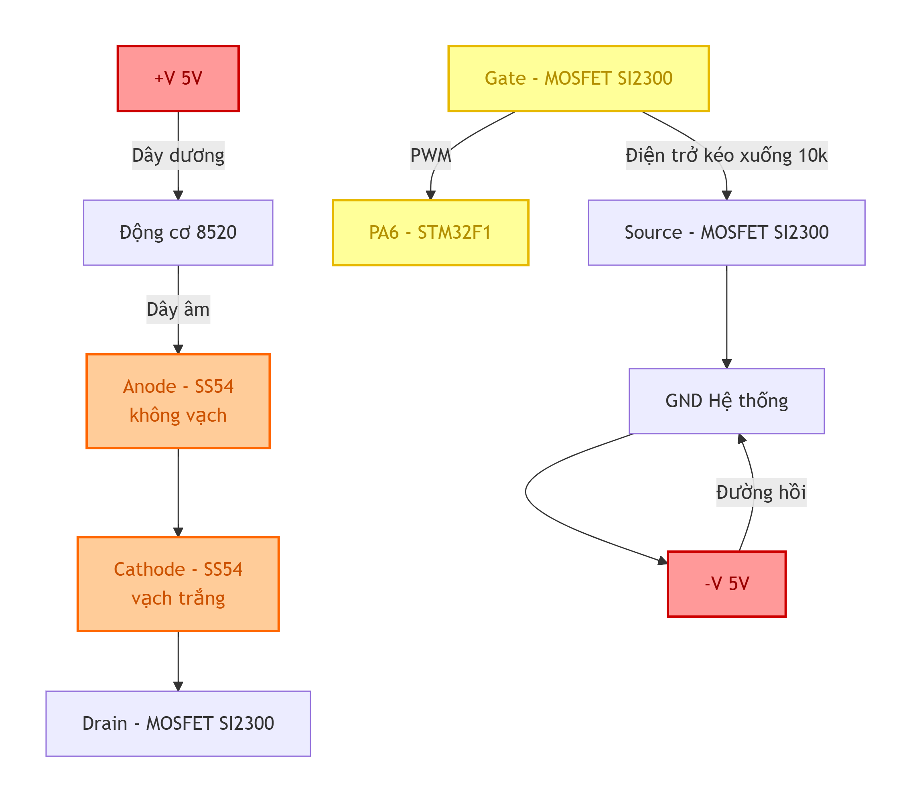

# Stage_10-Release: Test 1 motor (Bug_note)

PHẦN 1: GIẢI ĐÁP CÁC BÍ ẨN KỸ THUẬT VÀ PHẦN CỨNG
1. Bí ẩn ESP32-S3 bốc khói vs. STM32F1 "bất tử" khi đo đạc

Với ESP32-S3: Khi bạn cắm qua cổng Type-C, cổng này lấy điện trực tiếp từ máy tính hoặc củ sạc với dòng cung cấp rất lớn (có thể lên tới 2A - 3A). Khi bạn chọc 2 que đo đồng hồ vào sát nhau ở chân 5V và GND, khả năng cực kỳ cao là đầu kim loại của 2 que đo đã vô tình quẹt vào nhau, hoặc quẹt trúng chân linh kiện bên cạnh gây ra Đoản mạch (Short-circuit). Dòng điện khổng lồ 3A phóng thẳng qua làm chết IC nguồn hoặc diode bảo vệ trên ESP32 ngay lập tức khiến nó bốc khói.

Với STM32F1: Cục nạp ST-Link của bạn có dòng cấp cực kỳ yếu (tối đa chỉ 500mA) và bên trong nó có một cầu chì tự phục hồi (Poly-fuse). Dù bạn có lỡ tay làm chập que đo, cục ST-Link sẽ tự động ngắt điện ngay lập tức trước khi dòng điện kịp làm nướng chín vi điều khiển STM32. Hơn nữa, mạch Bluepill các chân được bố trí khá thoáng nên rủi ro chập que đo cũng thấp hơn.

2. Cách cấp nguồn cho 4 động cơ từ Tổ ong & Phác thảo Bluetooth JDY-33

Về việc nối 4 động cơ: Nguồn tổ ong của bạn có 2 ốc +V và 2 ốc -V. Bạn hoàn toàn có thể chụm 4 sợi dây dương của 4 động cơ lại thành một bó và siết chung vào 1 ốc +V (hoặc chia làm 2 bó, mỗi bó 2 dây siết vào 2 ốc +V cho đỡ chật). Tương tự với cực âm (sau khi qua MOSFET). Đây gọi là Mắc Song Song. Khi mắc song song, điện áp ở mọi động cơ đều bằng nhau (4.6V - 5V), động cơ không hề bị hư hỏng. Nguồn Tổ ong 10A dư sức gánh tổng dòng điện hút của cả 4 động cơ.

Phác thảo Bluetooth JDY-33 (SPP):

Phần cứng: Cấp nguồn 3.3V, GND cho JDY-33. Nối chéo chân: TX(JDY) -> RX(PA10 STM32), RX(JDY) -> TX(PA9 STM32).

Phần mềm: Dùng app "Serial Bluetooth Terminal" trên điện thoại kết nối.

Logic Code (Dự kiến): Dùng ngắt UART (Interrupt) nhận ký tự. Gửi 'A' để mở khóa cổng (Arm), 'D' để khóa khẩn cấp (Disarm), 'W' để tăng ga, 'S' để giảm ga. Viết logic cập nhật giá trị vào hàm PWM hiện tại.

3. Dùng chân PA6 (PWM) điều khiển vs. Cắm thẳng Nguồn Tổ ong

Bạn thắc mắc "Có nhất thiết dùng PWM không, hay cứ cắm nguồn cho nó quay?". Việc bạn "chích" thẳng dây vào nguồn Tổ ong nãy giờ chỉ là bài Test Phần Cứng (Hardware Validation) để xem motor có sống không, dòng điện có bị tắc không.

Khi lắp lên Drone, nếu cắm thẳng nguồn, động cơ sẽ luôn quay ở 100% công suất. Drone của bạn sẽ lao thẳng lên trần nhà và lật úp. Chân PA6 sinh ra chức năng băm xung PWM là để làm "Tay ga điện tử", giúp bạn điều chỉnh tốc độ motor mượt mà từ 0% đến 100%, từ đó thuật toán PID mới có thể tăng giảm vòng quay từng cánh quạt để giữ Drone thăng bằng. Bắt buộc phải đưa PA6 vào làm việc sau khi mạch đã thông.

4. Có cần dùng Logic Analyzer (Máy hiện sóng) không?

Rất Cần Thiết! Đồng hồ đo điện (VOM) chỉ đo được Điện áp trung bình (RMS). Ví dụ PWM 50% ở 3.3V nó sẽ chỉ hiện 1.65V. VOM hoàn toàn "mù tịt" về tần số sóng.

Bạn đang để ở mức 500Hz, sắp tới lên 4kHz. Khi cắm Logic Analyzer vào chân PA6, nó sẽ vẽ cho bạn thấy rõ ràng chu kỳ xung. Bạn sẽ biết chắc chắn code C cấu hình Timer của mình đang xuất ra đúng tần số 500Hz không, độ rộng sườn lên/xuống có bị méo hay nhiễu khi lắp tải vào không.

PHẦN 2: FILE COMMIT (Bạn copy nội dung dưới đây lưu thành file .md)

## 2.1. Cách sử dụng & Sơ đồ vòng kín mạch thực tế
Mạch hiện tại đang được giữ nguyên theo cách đấu dây (có phần lỗi lý thuyết) của mạch cũ để kiểm thử giới hạn phần cứng. 
* **Cách test:** Bật nguồn Tổ ong, nạp code, sử dụng phím bấm logic (hoặc ép giá trị trong code) để thay đổi Duty Cycle (0% - 50% - 100%).

**[Prompt dành cho DeepSeek để render sơ đồ Mermaid hệ thống]:**
> "Hãy vẽ sơ đồ Mermaid (graph TD) cho mạch điều khiển động cơ với cấu trúc: Nguồn 5V Tổ ong (+V) -> Dây Dương Động cơ 8520 -> Cuộn dây Động cơ -> Dây Âm Động cơ -> Đầu Anode (không vạch) của Diode SS54 (đang mắc nối tiếp sai) -> Đầu Cathode (có vạch) của Diode -> Chân Drain của MOSFET SI2300. Chân Gate MOSFET nối với tín hiệu PWM (PA6) kèm trở Pull-down 10k nối xuống GND. Chân Source MOSFET nối chung vào đường GND Hệ thống, cuối cùng chạy về cực -V của Tổ ong."

## 2.2. Bảng So Sánh 3 Trường Phái Đi Dây Phần Cứng

| Điểm kết nối | 1. Cách thiết kế Gốc (Tutorial / Lý thuyết) | 2. Thực hành Chuẩn Kỹ Thuật (Nên làm) | 3. Mạch hiện tại (Thực hành Sai Nguyên Lý) |
| :--- | :--- | :--- | :--- |
| **Dây Dương Motor (M+)** | Nối vào Nguồn Dương V+ | Cắm thẳng vào **+V** Tổ ong (5V) | Cắm vào **+V** Tổ ong |
| **Dây Âm Motor (M-)** | Nối vào chân Drain (D) | Hàn thẳng vào **chân Drain (D)** | Hàn vào **Đầu Không Vạch (Anode)** của Diode |
| **Đầu Vạch Trắng (Cathode)** | Nối vào Nguồn Dương V+ | Hàn chung vào điểm **+V Tổ ong** | Hàn vào **chân Drain (D)** của MOSFET |
| **Đầu Không Vạch (Anode)** | Nối vào chân Drain (D) | Hàn thẳng vào **chân Drain (D)** | Hàn vào **Dây Âm Motor (M-)** |
| **Hình thái Mạch Điện** | Diode mắc **Song Song** ngược chiều | Diode mắc **Song Song** ngược chiều | Diode mắc **Nối Tiếp** chen giữa Động cơ và MOSFET |
| **Kết quả bảo vệ MOSFET** | Hoàn hảo tuyệt đối | Hoàn hảo tuyệt đối | **KHÔNG CÓ TÁC DỤNG**. Xung ngược đập thẳng vào MOSFET. |

Cách đấu dây fail:

## 2.3. Mô tả tình trạng đã gặp và Chi tiết các phép đo

Trong quá trình Debug bằng Multimeter, mạch đã xuất hiện các tình trạng lỗi sau:

### Lỗi 1: Hiện tượng Hở Mạch do Thiếu Mass Chung
* **Tình trạng:** Nguồn Tổ ong có điện 4.6V nhưng động cơ không quay, đo điện áp 2 đầu động cơ = 0V.
* **Các phép đo (Cố định que Đen ở 2 vị trí GND khác nhau):**
    * **Trạm 1 (Chân Gate):** Nếu que đen ở GND Tổ ong -> `0V` | Nếu que đen ở GND STM32 -> `3.26V`.
    * **Trạm 2 (Chân Drain):** Nếu que đen ở GND Tổ ong -> `0.22V` | Nếu que đen ở GND STM32 -> `2.99V`.
    * **Trạm 3 (2 đầu Diode mắc ngược):** Đo ra `0.01V` hoặc `0.00V`.
    * **Trạm 4 (Hai đầu động cơ):** `0V`.
* **Ngoài ra:** Khi cắm GND STM32 vào lỗi có ký hiệu 3 gạch (⏚ Earth) trên Tổ ong, điện áp đo được ở Trạm 2 chỉ có `0.2V`.

### Lỗi 2: Sụt áp nội bộ STM32 (Brown-out). 
> 📝 Xem thêm ghi chép chi tiết tại: [Sụt_áp_khi_cắm_moto_trực_tiếp.txt](./Sụt_áp_khi_cắm_moto_trực%20tiếp.txt)
* **Tình trạng:** Nối trực tiếp dây Dương động cơ vào VCC (3.3V hoặc 5V) của board STM32F1. Động cơ chỉ quay được 1 lần, lần 2 tịt hẳn. KeilC văng lỗi ngắt kết nối `Cannot access target`.
* **Các phép đo (Khi cắm vào chân PA6 xuất PWM):**
    * Ở mức PWM 50%: Chân PA6 đo được `0.5V` (Động cơ lùng bùng, không quay).
    * Ở mức PWM 100%: Chân PA6 đo được `1V` (Thay vì 3.3V).
    * Khi nối thông 2 đường GND hai bên bo STM32: Áp PA6 sụt tiếp từ `3.25V` xuống `3.05V`.

### Lỗi 3: "Bóng Ma" trạng thái Reset (Floating Gate)
* **Tình trạng:** Vừa nạp code (Flash) hoặc bấm Stop+Reset, động cơ tự động kêu lên/quay max tốc. Bấm Run (F5) thì động cơ tắt.

## 2.4. Cách giải quyết vấn đề cho từng lỗi

1.  **Cách giải quyết Lỗi 1 (Thiếu Mass & Cắm sai Tổ ong):** Rút dây khỏi lỗ Earth (⏚). Bắt buộc dùng 1 sợi dây nối thông **Chân S (Source)** của MOSFET vào lỗ **-V** (Cực Âm thật sự) của nguồn Tổ ong. Dòng điện đã khép kín vòng tuần hoàn.
2.  **Cách giải quyết Lỗi 2 (Sụt áp Brown-out):** Mạch bị sụt áp do ST-Link (chỉ chịu tải 500mA) không gánh nổi động cơ (2A). Rút ngay dây dương động cơ ra khỏi lỗ VCC/5V của STM32, cắm TRỰC TIẾP dây dương động cơ vào ốc **+V** của Nguồn Tổ ong. Tách biệt hoàn toàn nguồn động lực và nguồn điều khiển tín hiệu (chỉ để chung Mass).
3.  **Cách giải quyết Lỗi 3 (Bóng ma Reset):** Hiện tượng xảy ra do chân PA6 bị thả trôi (Input Floating) lúc chip Reset, trong khi trở kéo mát (Pull-down 10k) bị hở chân hàn dẫn đến nhiễm tĩnh điện. Giải pháp: Hàn cứng lại điện trở 10k giữa chân Gate và Source. Mạch sẽ tự khóa an toàn cho đến khi có lệnh PWM từ phần mềm.