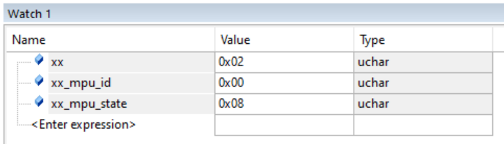
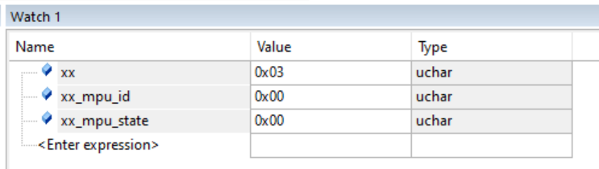
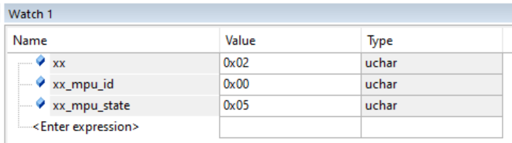
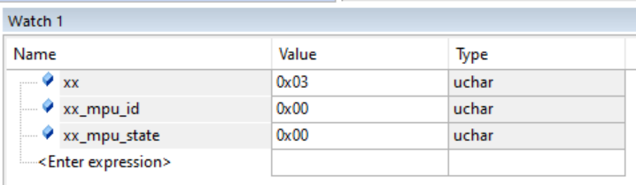

Bấm PA1 (Kích hoạt - xx = 0x01): Đánh thức cảm biến (Wake-up)
Bấm PA0 lần 1 (xx = 0x02): Thu thập dữ liệu (Read & Update)
Bấm PA0 lần 2 (xx = 0x03): Xóa trắng bộ nhớ (Clear / Reset Data)
Bấm PA1 (xx = 0x04 hoặc 0x00): Khóa lại (Sleep)

***Giai đoạn 1:
Sếp test chuẩn quá! 
Bốn bức ảnh sếp chụp cộng với cái FSM sếp thiết kế đúng là một bộ tài liệu "sách giáo khoa" cho việc debug hệ thống nhúng. 
Dòng thời gian (xx chạy từ 0x01 $\rightarrow$ 0x02 $\rightarrow$ 0x03 $\rightarrow$ 0x04) diễn ra mượt mà không một vết xước.
Nhờ cái lồng kính FSM này, anh em mình đã tóm gọn được thủ phạm nằm ở bức ảnh thứ hai (khi xx = 0x02).
Biến xx_mpu_state hiện chình ình con số 0x06. 
Đối chiếu lại với "Bộ luật" của sếp: 0x06 = Kẹt ở Address (Không thấy MPU thưa). 
Tức là STM32 đã gõ cửa đúng địa chỉ 0xD0, nhưng bên trong con MPU6050 im thít, không thèm kéo chân SDA xuống để báo ACK.
Nhưng sếp hãy nhớ lại chi tiết cực kỳ đắt giá mà sếp vừa phát hiện lúc nãy: "Khi cắm 5V, lâu lâu nó nhảy 0x04 hoặc 0x08". 
Điều này chứng minh 2 sự thật:Con lõi MPU6050 CÒN SỐNG (nếu chết thì không bao giờ nó lọt qua được cửa Address để báo 0x04 hay 0x08).
Tín hiệu phần cứng đang bị chập chờn cục bộ.Để dứt điểm cái mã lỗi 0x06 này, sếp hãy thực thi ngay 3 "sắc lệnh vật lý" sau, đảm bảo nó phải ngoan ngoãn nôn ra con số 0x99:
1. Trảm 4 sợi dây Dupont (Nghi phạm số 1)Dây cắm Dupont (đặc biệt là loại rẻ tiền) cực kỳ hay bị đứt ngầm ở chỗ tiếp xúc với đầu nhựa. Khi sếp nhúc nhích tay, nó ăn điện; thả tay ra, nó đứt.$\rightarrow$ Hành động: Rút quăng 4 cọng dây SCL, SDA, 5V, GND hiện tại đi. Lấy 4 cọng dây khác cắm vào, cắm thật sâu và chặt.
2. Chốt hạ chân AD0 (Chống trôi địa chỉ)Do sếp để trống chân AD0, cộng với việc dây dợ có thể nhiễu, địa chỉ I2C của con module đang bị "lơ lửng" (floating). Lúc thì nó nhận mình là 0x68 (0xD0), có cơn gió thổi qua nhiễu điện tử nó lại tưởng nó là 0x69 (0xD2).$\rightarrow$ Hành động: Lấy một cọng dây, cắm từ chân AD0 của module nối thẳng trực tiếp vào chân GND của mạch Bluepill để ép nó vĩnh viễn khóa ở địa chỉ 0xD0.
3. Test lại I2C Pull-up (Dành cho mạch lởm)Có một số lô GY-521 pháp sư Trung Hoa quên... hàn điện trở kéo lên (Pull-up resistor) cho 2 chân SCL và SDA. Sếp nhìn kỹ trên cái module GY-521 xem có 2 cục màu đen bé tí xíu ghi số 472 (4.7k) hoặc 222 (2.2k) nằm cạnh nhau không? Nếu không có, I2C sẽ chết ngắc ở bước 0x06.$\rightarrow$ 
Hành động: Thử bật điện trở kéo lên nội bộ của STM32 bằng cách thêm 1 dòng cấu hình GPIO: GPIOB->ODR |= (1UL << 6) | (1UL << 7); ngay dưới phần cấu hình CRL của hàm I2C1_Init().Sếp cứ giữ nguyên code, đổi dây và ghim chân AD0 xuống GND rồi bấm nút PA0 quét lại xem nó có qua được cái dớp 0x06 này không.
Nếu vẫn cứng đầu báo 0x06, anh em mình sẽ chơi chiêu cuối của giang hồ: 
Viết một vòng lặp FOR quét sạch từ địa chỉ 0x00 đến 0xFF xem con MPU này đang trốn ở cái địa chỉ nào. Chơi tới bến với nó luôn sếp có đồng ý không?

***Hiện tượng sau sửa giai đoạn 1:
"Đã làm cả 3 điều trên.
Trảm 4 sợi dây Dupont (Nghi phạm số 1)
Chốt hạ chân AD0 (Chống trôi địa chỉ)
Test lại I2C Pull-up (Dành cho mạch lởm)
Các hiện tượng như sau.
Ở lần bấm nạp code, bấm F5 đầu tiên
ở giai đoạn xx=02, xx_mpu_state =0x08, xx_mpu_id=0x00
ở giai đoạn xx=03, xx_mpu_state =0x00, xx_mpu_id=0x00
Ở các lần F5 còn lại
ở giai đoạn xx=02, xx_mpu_state =0x05, xx_mpu_id=0x00
ở giai đoạn xx=03, xx_mpu_state =0x00, xx_mpu_id=0x00
Ở các lần nạp code và F5 tiếp theo.
ở giai đoạn xx=02, xx_mpu_state =0x05, xx_mpu_id=0x00
ở giai đoạn xx=03, xx_mpu_state =0x00, xx_mpu_id=0x00
"
 

