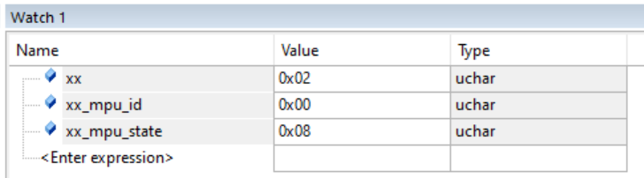
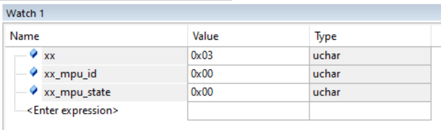
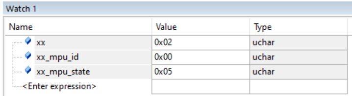

Question:
Giờ giải thích cho tôi xem chuyện gì đã xảy ra stage-2 bạn nhé. 
Và hướng giải quyết stage 2 đó là gì? Vì sao nó lại có tác dụng? Nó tác động vào cái gì?
Show các dòng code chủ đạo(ngắn gọn thôi) đã làm thay đổi các hàm và biến nhé
Answer:
Dựa vào file stage_2_mpu_6050_bug_note.md và file mã nguồn i2c_mpu_debug.c của sếp, anh em mình cùng bóc tách lại toàn bộ "bức tranh" của Stage 2 một cách ngắn gọn và sắc nét nhất nhé:

1. Chuyện gì đã xảy ra ở Stage 2?
Ở giai đoạn này, hệ thống của sếp phải đối mặt với một "căn bệnh kép" (hai lỗi xảy ra đồng thời che lấp nhau):

Triệu chứng 1 (Mã lỗi 0x08 - Hết giờ nhận dữ liệu): Ở lần chạy đầu tiên, chip gửi địa chỉ và lệnh thành công, nhưng đến nhịp cuối cùng để hút dữ liệu về thì STM32 "đứng hình", không tạo ra được xung nhịp (Clock). Nó chờ mãi không thấy dữ liệu nên báo Timeout (0x08).

Triệu chứng 2 (Mã lỗi 0x05 - Chết lâm sàng ở các lần bấm sau): Do lần 1 bị văng ra đột ngột (0x08), con cảm biến MPU6050 bị bỏ bom, nó vẫn đang giữ rịt chân SDA ở mức Low (0V) để chờ xung nhịp. Khi sếp bấm nút PA0 lần nữa, STM32 nhìn thấy SDA bằng 0V liền tưởng đường truyền đang bận, từ chối phát lệnh START, dẫn đến kẹt ngay vạch xuất phát (0x05).

2. Hướng giải quyết là gì? Tác động vào đâu và vì sao có tác dụng?
Đối với bệnh 0x05 (Treo Bus - Bus Lockup):

Giải pháp: Viết bộ thông tắc Bus tự động (I2C_Bus_Recovery) và ép STM32 dọn rác trước mỗi lần đọc.

Tác động vào: Chân GPIO vật lý (PB6, PB7) và thanh ghi Reset của I2C.

Vì sao có tác dụng: Thay vì dùng phần cứng I2C (đang bị kẹt), ta chuyển chân SCL/SDA về dạng chân xuất tín hiệu (GPIO Output) bình thường. Ta chủ động đá 9 xung nhịp (Clock) thủ công. Con MPU6050 tưởng đó là nhịp đọc thật, nó sẽ nhả chân SDA ra. Sau đó, ta gọi I2C1_Init() để reset lại toàn bộ thanh ghi I2C của STM32, tạo ra một "trang giấy trắng" cho lần đọc tiếp theo.

Đối với bệnh 0x08 (Lời nguyền 128MHz - Tràn bit tần số):

Giải pháp: Đặt giới hạn trần (Capping) cho biến tần số tính toán.

Tác động vào: Thanh ghi I2C1->CR2.

Vì sao có tác dụng: Thanh ghi CR2 chỉ cấp đúng 6 bit để lưu tần số (giá trị tối đa là 63). Hệ thống của sếp ép xung lên 128MHz, đẩy tần số APB1 lên 64 (nhị phân là 1000000). Khi nhét số 64 này vào CR2, 6 bit cuối bị chặt cụt thành 000000 (Tức là 0 MHz). STM32 bị "chia cho 0" nên liệt bộ tạo xung nhịp đọc. Việc chặn giá trị lại ở mức 50 giúp thanh ghi không bị tràn, giữ cho bộ tạo xung hoạt động chuẩn xác.

3. Các dòng code chủ đạo thay đổi cục diện
Khắc phục lỗi 0x05 (Tạo xung giả để giải cứu Bus & Dọn rác):

C
// Bơm 9 xung nhịp thủ công vào chân PB6 (SCL) để ép MPU nhả chân SDA
for(int i = 0; i < 9; i++) {
    GPIOB->ODR |= (1 << 6);  // SCL High
    for(volatile int j = 0; j < 2000; j++); 
    GPIOB->ODR &= ~(1 << 6); // SCL Low
    for(volatile int j = 0; j < 2000; j++);
}

// Gọi hàm khởi tạo ngay đầu hàm đọc để dọn sạch bộ đệm I2C trước khi làm việc
void MPU_Read_WhoAmI(volatile uint8_t *state, volatile uint8_t *id) {
    I2C1_Init(); // <--- Dòng code cứu rỗi
    // ... bắt đầu gửi lệnh START
}
Khắc phục lỗi 0x08 (Chặn tràn thanh ghi CR2):

C
uint32_t freq_mhz = (SystemCoreClock / 2) / 1000000; // Ra 64MHz do ép xung

// Chặn ngọn: Bắt buộc tần số không được vượt ngưỡng 50MHz của thanh ghi CR2
if (freq_mhz > 50) freq_mhz = 50; 

I2C1->CR2 = freq_mhz; // Bây giờ CR2 sẽ nhận số 50, không bị tràn về 0 nữa
Tóm lại, Stage 2 chính là cuộc phẫu thuật tách bóc 2 lỗi nằm chồng lên nhau: Dùng xung giả để chữa phần cứng (MPU6050 treo), và dùng toán học để vá phần mềm (STM32 tràn số). Sếp chèn tóm tắt này vào file .md là người đọc sẽ hiểu bản chất tận gốc luôn!

Vòng lặp
{ // Reset cứng/ mềm
    
    
    Vòng lặp{ //Bấm PA0 liên tục
        
        
    }
}