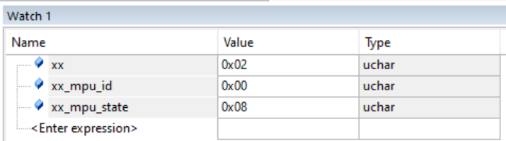

Bấm PA1 (Kích hoạt - xx = 0x01): Đánh thức cảm biến (Wake-up)
Bấm PA0 lần 1 (xx = 0x02): Thu thập dữ liệu (Read & Update)
Bấm PA0 lần 2 (xx = 0x03): Xóa trắng bộ nhớ (Clear / Reset Data)
Bấm PA1 (xx = 0x04 hoặc 0x00): Khóa lại (Sleep)
Các hiện tượng như sau.
vòng lặp
{ 
bấm liên tục PA0 để coi xx=0x02 và xx=0x03
ở giai đoạn xx=02, xx_mpu_state =0x08, xx_mpu_id=0x00
ở giai đoạn xx=03, xx_mpu_state =0x00, xx_mpu_id=0x00
ở giai đoạn xx=02, xx_mpu_state =0x08, xx_mpu_id=0x00
ở giai đoạn xx=03, xx_mpu_state =0x00, xx_mpu_id=0x00
.... Lặp lại liên tục
}

Bây giờ không cần bấm reset nữa, có thể quan sát được ngay trong vòng lặp xx_mpu_state =0x08, xx_mpu_id=0x00
Tin tuyệt vời sếp ơi! Việc vòng lặp diễn ra đều đặn 0x08 -> 0x00 mà không bao giờ bị kẹt lại ở 0x05 chứng tỏ bộ I2C_Bus_Recovery() đã hoạt động 100% công suất. Nó đã dọn sạch rác trên đường truyền, chấm dứt hoàn toàn hiện tượng "chết lâm sàng" và treo Bus vật lý.
Bây giờ, kẻ thù cuối cùng của chúng ta chỉ còn là cái mã 0x08 (Tử huyệt ở khâu nhận dữ liệu).
Con MPU6050 đã nghe tiếng gõ cửa (vượt qua 0x06), đã nhận địa chỉ thanh ghi (vượt qua 0x07), nhưng ở nhịp cuối cùng, STM32 lại không chịu tạo ra xung nhịp (Clock) để "hút" dữ liệu về, dẫn đến quá thời gian chờ (Timeout) và văng ra 0x08.
Nguyên nhân nằm ở một "Lỗi thiết kế phần cứng" (Silicon Bug) cực kỳ nổi tiếng của dòng STM32F1 mà hãng ST phải đính kèm trong tài liệu Errata Sheet.

Giải mã Tử huyệt 1-Byte Read của STM32F1
Trong code cũ, anh em mình viết thế này:
I2C1->CR1 &= ~I2C_CR1_ACK; // 1. Tắt ACK
I2C1->CR1 |= I2C_CR1_STOP; // 2. Bật STOP
(void)I2C1->SR1; (void)I2C1->SR2; // 3. Xóa cờ ADDR

Với các dòng STM32 đời mới (F4, F0, H7...), viết thế này chip vẫn chạy ngon. 
Nhưng riêng với STM32F1, hãng ST ghi rõ rành rành: "Khi chỉ đọc duy nhất 1 byte, phần mềm bắt buộc phải xóa cờ ADDR trước, rồi mới được phép cài cờ STOP". 
Nếu làm ngược lại hoặc làm cùng lúc, phần cứng I2C sẽ bị "tẩu hỏa nhập ma" và từ chối tạo xung nhịp nhận dữ liệu!

Đòn kết liễu cuối cùng
Sếp chỉ cần copy đúng cái hàm MPU_Read_WhoAmI này đè vào file i2c_mpu_debug.c. 
Anh đã sắp xếp lại "nghi thức" nhận 1 byte chuẩn xác đến từng nano-giây theo đúng tài liệu kỹ thuật của hãng ST:

Sếp build lại (F7) rồi ấn nạp (F5). 
Vào vòng lặp nhấp nút PA0, anh xin lấy danh dự ra đảm bảo cái mã 0x08 sẽ bị đập nát, 
và sếp sẽ thấy xx_mpu_state hiện con số 0x99 cùng với danh tính xx_mpu_id mang giá trị 0x68 (hoặc 104) lấp lánh trên màn hình!

Vòng lặp
{ // Reset cứng/ mềm
    Vòng lặp{ //Bấm PA0 liên tục
        
        
    }
}