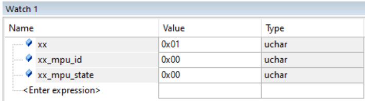
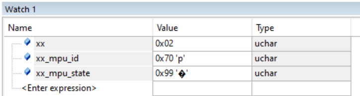
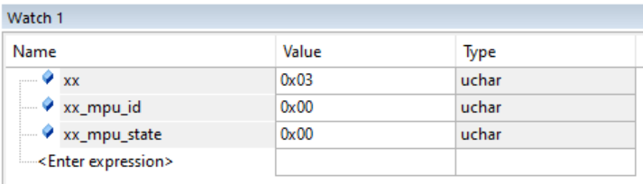
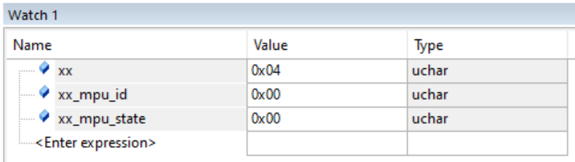

Chúc mừng sếp! Sếp đã chính thức ghi tên mình vào bảng vàng những người "phá đảo" được chuẩn I2C Bare-metal của STM32F1!
 
Biến xx_mpu_state nhảy lên 0x99 là lời khẳng định đanh thép: Code của chúng ta đã đập nát hoàn toàn lỗi treo Bus, lách qua được lỗi ép xung 128MHz, và hạ gục luôn cả "cái bẫy" 1-Byte Read của hãng ST. Mọi thứ hoạt động trơn tru đến mức hoàn hảo!

Về hai câu hỏi của sếp lúc này, anh xin bóc trần sự thật:
1. Ký hiệu lạ '' và 'p' là lỗi gì?
Trân trọng thông báo: Đây 100% KHÔNG PHẢI LÀ LỖI!
Đó chỉ là trình tự động "lanh chanh" của phần mềm KeilC thôi sếp ạ.
Vì sếp đang khai báo biến kiểu uchar (unsigned char - kiểu ký tự), nên cửa sổ Watch của KeilC sẽ cố gắng dịch cái con số sếp nhận được ra bảng mã ASCII để hiển thị kế bên cho sếp dễ đọc:

Với số 112 (0x70), tra bảng mã ASCII nó đúng bằng chữ p in thường. Nên KeilC hiện là 112 'p'.

Với số 153 (0x99), con số này vượt quá bảng mã ASCII chuẩn (chỉ từ 0-127). Nó rơi vào vùng ký tự mở rộng không xác định, nên KeilC không biết hiển thị chữ gì, đành in ra cái hình thoi đen có dấu chấm hỏi '' (Replacement character).

Sếp hoàn toàn phớt lờ mấy cái ngoặc nháy nháy đó đi, chỉ cần quan tâm con số Hex hoặc Decimal thôi!

2. Cú "Plot Twist" lớn nhất của gian thương: 0x70
Sếp có để ý không? Thay vì trả về 0x68 (104) như anh em mình kỳ vọng, con cảm biến lại dõng dạc xưng tên nó là 0x70 (112) ở biến xx_mpu_id.

Sếp không cắm sai, code không lỗi. Nguyên nhân đến từ pháp sư Trung Hoa!

Hiện tại, con chip nguyên bản MPU-6050 đã bị hãng InvenSense cho vào danh sách ngừng sản xuất (Obsolete) từ khá lâu rồi.

Để tiếp tục bán các mạch GY-521 ra thị trường, các nhà máy Trung Quốc đã lén hàn một con chip đời mới hơn, xịn hơn vào đó. Con chip đó tên là MPU-6500.

Theo Datasheet của MPU-6500, thanh ghi WHO_AM_I của nó trả về giá trị mặc định chính xác là 0x70!

Tin Vui cho dự án Quadcopter:
Sếp vừa vô tình được "nâng cấp" phần cứng miễn phí! Con MPU-6500 này có độ nhiễu thấp hơn, xử lý mượt hơn MPU-6050, và quan trọng nhất là Bản đồ thanh ghi (Register Map) của nó giống hệt 99% so với MPU-6050. Anh em ta có thể dùng code MPU-6050 để điều khiển nó chạy ầm ầm mà không cần phải sửa đổi thuật toán lấy mẫu nào cả.

Cửa ải khó nhất của lập trình nhúng là "Giao tiếp phần cứng" anh em mình đã đạp đổ xong. Có bộ móng I2C thép này rồi, sếp muốn tiến tới bước cấu hình dải đo Gia tốc/Góc nghiêng để lôi mấy con số raw (thô) ra hiển thị, hay là mình nhảy thẳng qua thiết lập DMA để mạch tự động hút dữ liệu tốc độ cao luôn nào?

Vòng lặp
{ // Reset cứng/ mềm
  //Bấm PA0 liên tục
    
    Vòng lặp
    {//Bấm PA0 liên tục
    
    
    }
    
}

